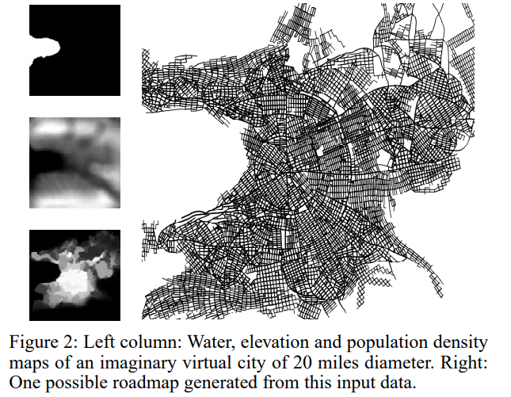
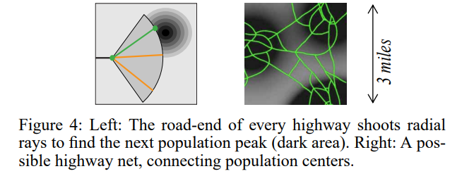
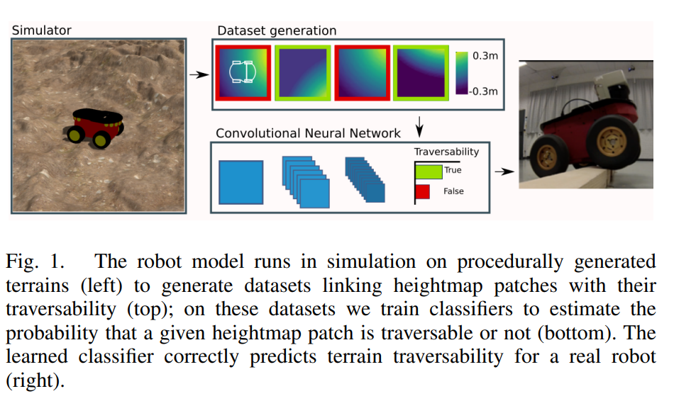
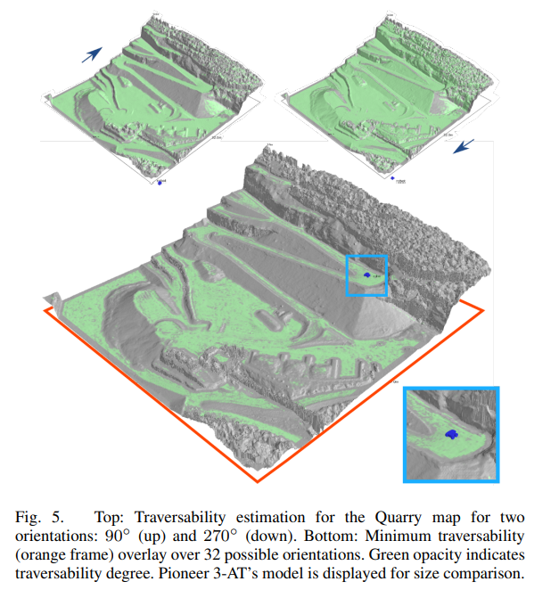
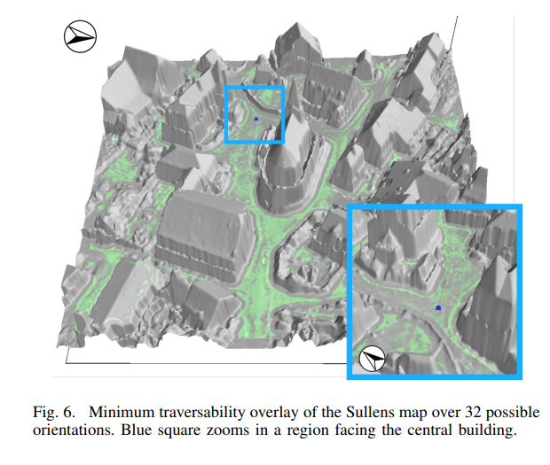
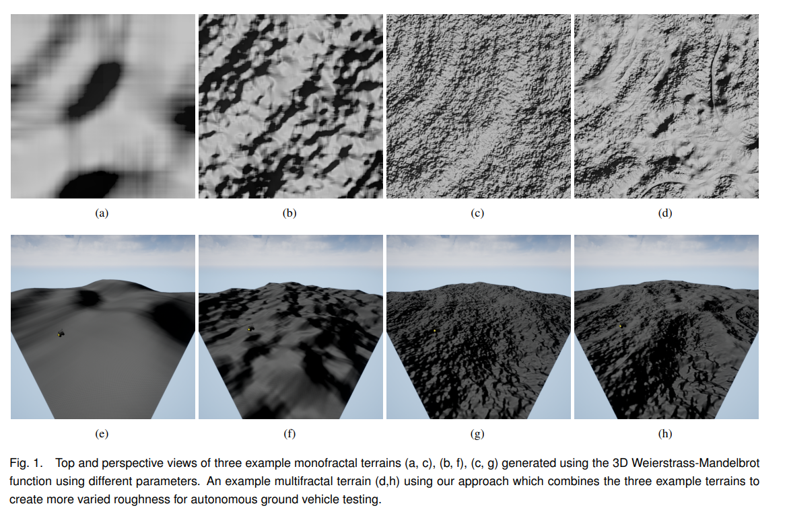
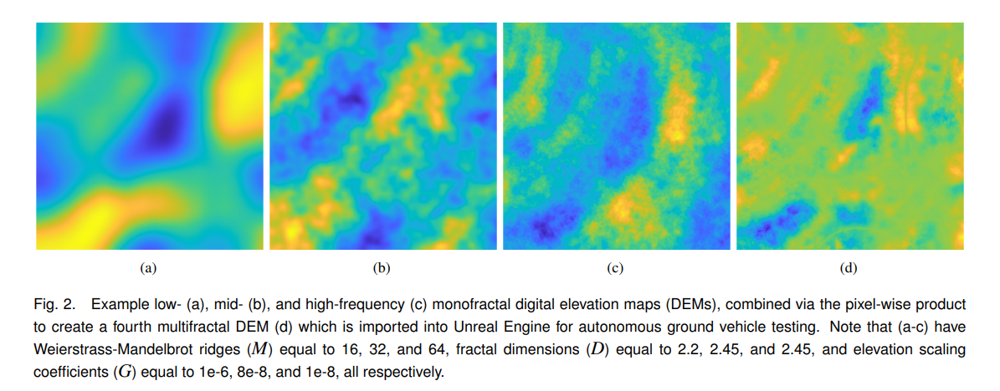

### Procedural city/road generation  
<https://cgl.ethz.ch/Downloads/Publications/Papers/2001/p_Par01.pdf>  
#### Can be useful for large-scale terrain realism
- The paper demonstrates how a water map, an elevation map, and a population density map can be used as inputs to apply an L-system for generating a set of roads.  
  -   
- By applying L-systems to an elevation map, fractals can be generated and integrated into the existing terrain, followed by blurring techniques to create more realistic large-scale terrain features.  
  - 
---
### Learning Ground Traversability from Simulations  
<https://idsia-robotics.github.io/files/publications/chavez-garcia2018.pdf>  
#### Can be useful for traversability estimation
- The paper demonstrates how a terrain patch can be classified as "traversable" or "not traversable" using a CNN.
  - Inputs: Local heightmap patches centered at the robot's position and aligned with its orientation.
  - Labels: Generated by simulating a robot (Pioneer 3-AT) in Gazebo with the ODE physics engine; if the robot successfully proceeds in the patch direction, it is labeled "traversable", otherwise "non-traversable".
  - Output: Binary classification - "traversable" vs. "not traversable".
  - 
- A full training pipeline is presented:
  - Procedurally generated terrains via Perlin/Simplex noise with varied features (e.g., slopes, bumps, holes, steps).
  - ~450,000 labeled samples collected over simulated trajectories.
  - Simulation is much faster and safer than real-world data collection.
- Both procedural synthetic and real-world datasets were used:
  - Real-world maps include urban areas, slopes, and mining quarries - some obtained via drones and RGB-D sensors.
  - Evaluation shows good transfer from simulation to real data.
  - 
- The CNN-based classifier:
  - Uses raw elevation data (no handcrafted features).
  - Includes convolutional + pooling layers followed by dense layers with softmax output.
  - Trained using Keras with Adadelta optimizer over 100 epochs.
- CNNs significantly outperform:
  - Feature-based classifiers using HOG descriptors + Random Forests.
  - Baselines that always predict the majority class.
  - 
- Application: Traversability Maps and Path Planning
  - CNN is applied densely across heightmaps for multiple orientations.
  - A turnability classifier is also trained to predict if a robot can rotate in place on a patch.
  - A graph-based planner computes Pareto-optimal paths balancing length vs. traversability.
  - Demonstrated in real-world settings (e.g., a robot navigating a grassy slope using a safe sidewalk route).
- Computational Efficiency
  - CNN inference is ~1000× faster than full physics simulation.
  - Suitable for large-scale maps: ~3200 patches/m² processed in ~350ms on CPU.
- Limitations and Future Work
  - Assumes terrain shape is the main factor - does not account for friction, material properties, or dynamics like approach speed.
  - Real-world generalization depends on how well simulation reflects real terrain diversity.
  - Suggests future models can incorporate robot self-experience or visual appearance cues for terrain classification.
---
### Multifractal Terrain Generation for Evaluating Autonomous Off-Road Ground Vehicles  
<https://arxiv.org/pdf/2501.02172>  
#### Can be useful for small-scale rough terrain generation
- The paper applies 3D Weierstrass-Mandelbrot noise to generate rough terrains.
- Instead of using monofractal noise, multiple layers of fractal noise are combined.
- 
- Multiple monofractal terrains (low-, mid-, high-frequency) are generated using different W-M parameters and combined via pixel-wise multiplication.
- Varying the fractal dimension D of the high-frequency terrain component affects overall terrain roughness and traversability.
- 
- The terrains are rendered in Unreal Engine as 50.4x50.4 m landscapes for AGV testing using a simulated Clearpath Husky.
  - Resolution: 5cm / pixel
---
### Terrain generation using genetic algorithms  
<https://www.cs.york.ac.uk/rts/docs/GECCO_2005/Conference%20proceedings/docs/p1463.pdf>  
#### _Add description here_

---
### PTRM: Perceived Terrain Realism Metric  
<https://dl.acm.org/doi/10.1145/3514244>  
#### _Add description here_

---
### Controlled Procedural Terrain Generation Using Software Agents  
<https://ianparberry.com/pubs/terrain.pdf>  
#### _Add description here_

---
### A multivariate Weierstrass–Mandelbrot function  
<https://www.researchgate.net/publication/239037074_A_Multivariate_Weierstrass-Mandelbrot_Function>  
#### _Add description here_

---
### Fractal terrain generation for vehicle simulation  
<https://www.academia.edu/84221963/Fractal_terrain_generation_for_vehicle_simulation>  
#### _Add description here_

