### Procedural Modeling of Cities
<https://cgl.ethz.ch/Downloads/Publications/Papers/2001/p_Par01.pdf>  
#### Can be useful for large-scale terrain realism
- The paper demonstrates how a water map, an elevation map, and a population density map can be used as inputs to apply an L-system for generating a set of roads.  
  -   
- By applying L-systems to an elevation map, fractals can be generated and integrated into the existing terrain, followed by blurring techniques to create more realistic large-scale terrain features.  
  - 
---
### Learning Ground Traversability from Simulations  
<https://idsia-robotics.github.io/files/publications/chavez-garcia2018.pdf>  
#### Can be useful for traversability estimation
- The paper demonstrates how a terrain patch can be classified as "traversable" or "not traversable" using a CNN.
  - Inputs: Local heightmap patches centered at the robot's position and aligned with its orientation.
  - Labels: Generated by simulating a robot (Pioneer 3-AT) in Gazebo with the ODE physics engine; if the robot successfully proceeds in the patch direction, it is labeled "traversable", otherwise "non-traversable".
  - Output: Binary classification - "traversable" vs. "not traversable".
  - 
- A full training pipeline is presented:
  - Procedurally generated terrains via Perlin/Simplex noise with varied features (e.g., slopes, bumps, holes, steps).
  - ~450,000 labeled samples collected over simulated trajectories.
  - Simulation is much faster and safer than real-world data collection.
- Both procedural synthetic and real-world datasets were used:
  - Real-world maps include urban areas, slopes, and mining quarries - some obtained via drones and RGB-D sensors.
  - Evaluation shows good transfer from simulation to real data.
  - 
- The CNN-based classifier:
  - Uses raw elevation data (no handcrafted features).
  - Includes convolutional + pooling layers followed by dense layers with softmax output.
  - Trained using Keras with Adadelta optimizer over 100 epochs.
- CNNs significantly outperform:
  - Feature-based classifiers using HOG descriptors + Random Forests.
  - Baselines that always predict the majority class.
  - 
- Application: Traversability Maps and Path Planning
  - CNN is applied densely across heightmaps for multiple orientations.
  - A turnability classifier is also trained to predict if a robot can rotate in place on a patch.
  - A graph-based planner computes Pareto-optimal paths balancing length vs. traversability.
  - Demonstrated in real-world settings (e.g., a robot navigating a grassy slope using a safe sidewalk route).
- Computational Efficiency
  - CNN inference is ~1000× faster than full physics simulation.
  - Suitable for large-scale maps: ~3200 patches/m² processed in ~350ms on CPU.
- Limitations and Future Work
  - Assumes terrain shape is the main factor - does not account for friction, material properties, or dynamics like approach speed.
  - Real-world generalization depends on how well simulation reflects real terrain diversity.
  - Suggests future models can incorporate robot self-experience or visual appearance cues for terrain classification.
---
### Multifractal Terrain Generation for Evaluating Autonomous Off-Road Ground Vehicles  
<https://arxiv.org/pdf/2501.02172>  
#### Can be useful for small-scale rough terrain generation
- The paper applies 3D Weierstrass-Mandelbrot noise to generate rough terrains.
- Instead of using monofractal noise, multiple layers of fractal noise are combined.
- 
- Multiple monofractal terrains (low-, mid-, high-frequency) are generated using different W-M parameters and combined via pixel-wise multiplication.
- Varying the fractal dimension D of the high-frequency terrain component affects overall terrain roughness and traversability.
- 
- The terrains are rendered in Unreal Engine as 50.4x50.4 m landscapes for AGV testing using a simulated Clearpath Husky.
  - Resolution: 5cm / pixel
---
### Terrain Generation Using Genetic Algorithms  
<https://www.cs.york.ac.uk/rts/docs/GECCO_2005/Conference%20proceedings/docs/p1463.pdf>  
#### Can be useful for user-guided large-scale terrain generation with obstacles
- The paper proposes a two-stage genetic algorithm (GA) approach for 3D terrain generation using intuitive user input.
- Existing procedural and fractal techniques are fast but lack user control; sculpting is flexible but labor-intensive; GIS data is realistic but inflexible.
- This method combines the benefits of real-world terrain features and controllable layout while minimizing user effort.
- Stage 1: Terrain Silhouette Generation
  - Input: A rough 2D map with labeled regions (e.g., hills, mountains) either hand-drawn or randomly generated.
  - A GA is used to refine polygonal region boundaries into more natural silhouettes by encoding angle-based transitions.
  - 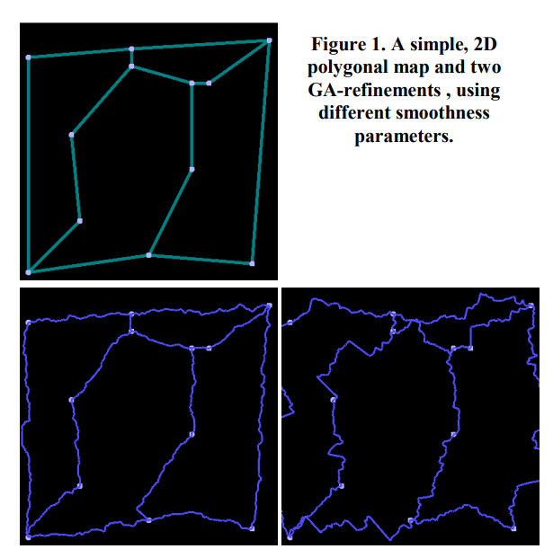
  - Fitness function measures boundary smoothness, applied across multiple levels of detail (granularities).
  - Each boundary segment can have its own smoothness parameter (S) for realism.
  - Crossover and mutation operators modify angles between line segments to evolve natural shapes.
  - 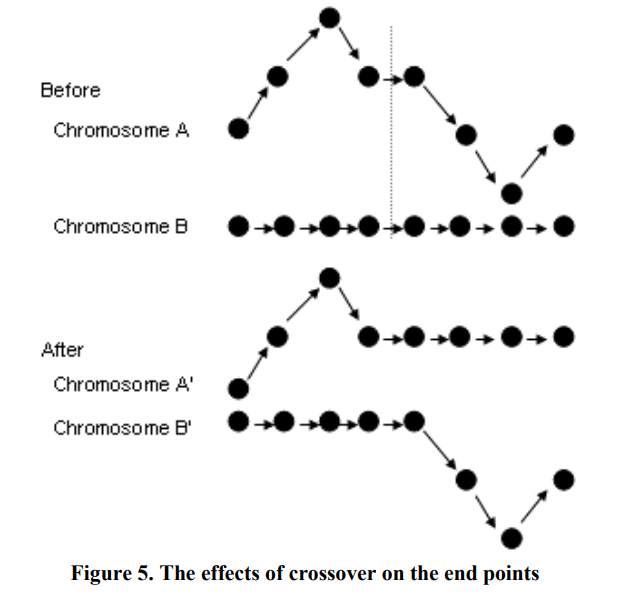
- Stage 2: Terrain Height Field Generation
  - Input: The refined silhouette and a database of real-world or user-created terrain height field samples.
  - Each chromosome represents a sequence of transformations (e.g., rotate, scale) applied to overlapping patches of height data.
  - Patches are blended using Gaussian kernels to avoid seams.
  - Fitness function evaluates:
    - Resemblance of terrain patches to example samples.
    - Smooth transitions at region boundaries (no sharp cliffs).
    - Terrain feature characteristics like slope, frequency content, and presence of ridges/valleys.
  - Retains region-level fitness to guide crossover/mutation locally and avoid slow convergence.
  - Supports repeatability via fixed random seeds for deterministic outputs.
  - 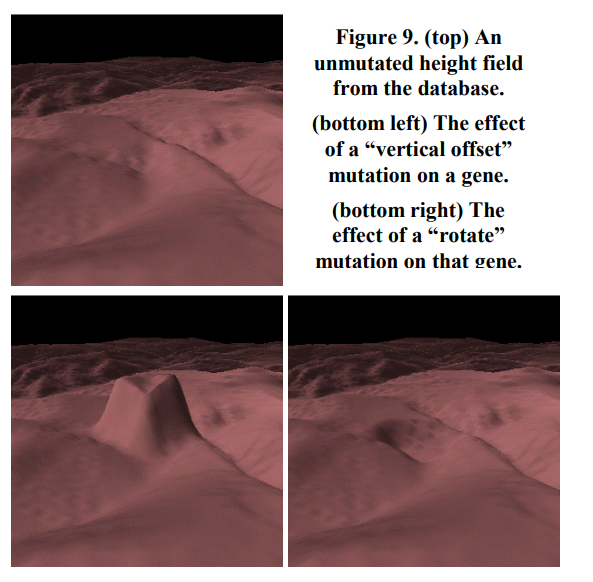
- Advantages
  - Produces diverse, realistic terrains from limited user input.
  - Balances procedural freedom with realism from data.
  - Encodes operations rather than full heightmaps, making it scalable.
  - Designed to be implemented as a plugin or standalone tool.
- Limitations & Future Work
  - Silhouette GA limited by angular constraints - exploring more flexible edge modeling.
  - Currently uses manually labeled terrain samples - aims to automate with image processing and classification.
  - Future fitness functions could improve feature coherence and support rivers or complex transitions.
---
### PTRM: Perceived Terrain Realism Metric  
<https://dl.acm.org/doi/10.1145/3514244>  
#### Can be useful for realistic large-scale terrain generation
- Terrains have certain features (pits, ridges, footslopes, etc.)
- 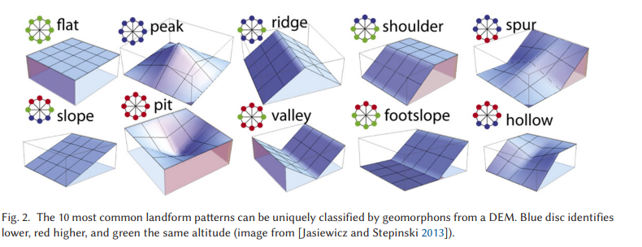
- Introduces a perceptual realism metric (PTRM) for terrains based on human perception.
- Input: Digital Elevation Map (DEM).
- Output: A normalized realism score (0.0-1.0) based on geomorphological features.
- Relies on geomorphons, localized landform features.
  - Geomorphons are extracted from DEMs using the GRASS GIS tool.
  - 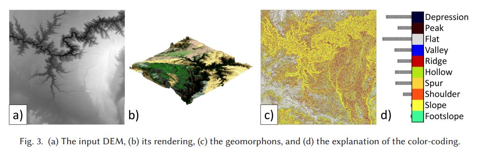
- Two large-scale user studies were conducted (2AFC design via Amazon Mechanical Turk):
  - Experiment 1: Compared real vs. synthetic terrains for perceived realism.
  - Experiment 2: Assessed terrains after CycleGAN-based feature transfer (real<->synthetic).
  - 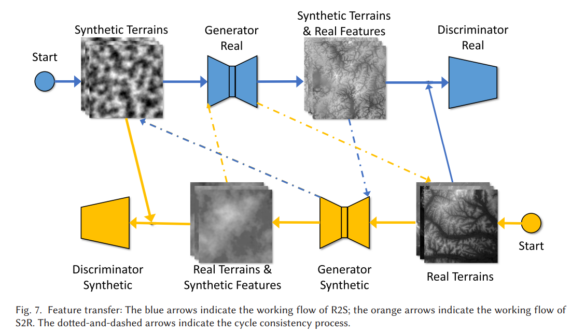
  - 
- Strong correlation found between certain features and perceived realism:
  - Highest positive impact: Valley (0.66), Ridge (0.64), Peak (0.44).
  - Negative impact: Slope (-0.65), Shoulder (-0.17), Flat (-0.10).
- Applications:
  - Quantitative validation of terrain realism for simulations or game environments.
  - Guiding procedural generation to include perceptually important terrain features.
- Limitations:
  - Does not account for large-scale terrain structure or visual elements like vegetation.
  - Sensitive to DEM resolution (~200m/pixel in the study).
---
### A multivariate Weierstrass-Mandelbrot function  
<https://www.researchgate.net/publication/239037074_A_Multivariate_Weierstrass-Mandelbrot_Function>  
#### Can be useful for small-scale terrain generation
- The 3D W-M function is used to assign elevation values `z(x, y)` at grid locations `(x, y)` in a Digital Elevation Map (DEM), generating complex, fractal-like terrain structures.
- The elevation at a point `(x, y)` is given by: 
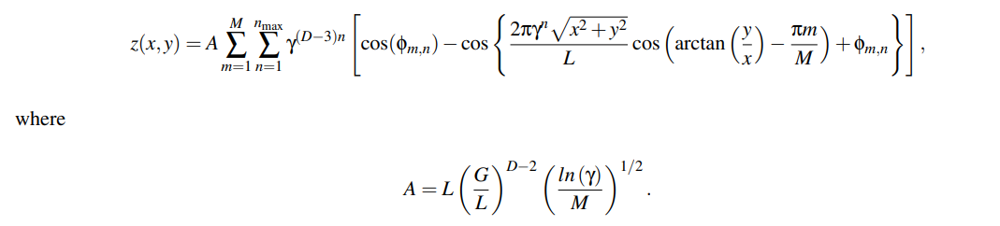
#### Parameter Descriptions
- `x, y`: Grid coordinates on the DEM.
- `z(x, y)`: Elevation value at location `(x, y)`.
- `M`: Number of directions (ridge-like surface layers).
- `n`: Frequency index (ranging from 1 to `n_max`).
- `n_max`: Upper cutoff for frequency components.
- `γ` (gamma): Frequency scaling factor (controls frequency density).
- `D`: Fractal dimension (controls roughness/complexity).
- `ϕ{m,n}`: Uniform random phase for each wave component (adds randomness).
- `L`: Sampling length.
- `G`: Elevation scaling coefficient.
- `A`: Amplitude normalizer for maintaining scale consistency.
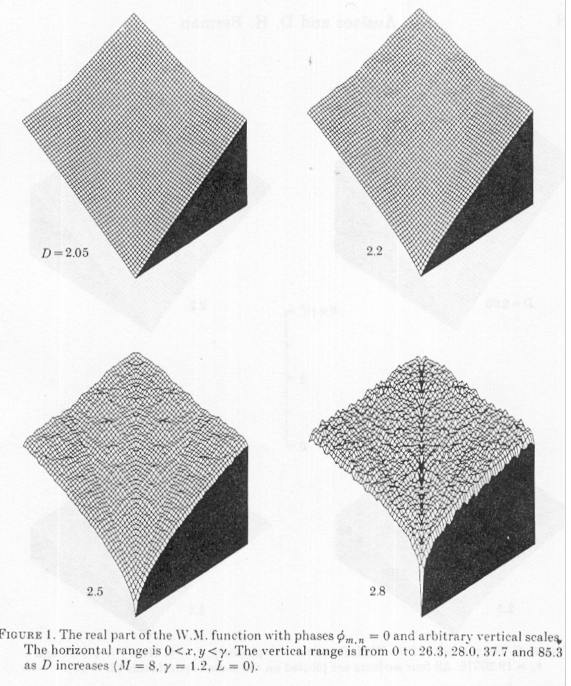
---
### Fractal terrain generation for vehicle simulation  
<https://www.academia.edu/84221963/Fractal_terrain_generation_for_vehicle_simulation>  
#### Can be useful for small-scale terrain generation
- The 3D Weierstrass-Mandelbrot function was used.
- The paper discusses RMSE (Root Mean Squared Elevation), a common method of describing surface roughness
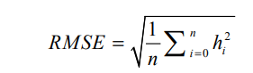
  - `h`: profile height
  - `n`: number of samples
  - Drawbacks: the profile must have a uniform roughness to be well-described by RMSE.
- Power Spectral Density (PSD) is also a useful method for roughness estimation.
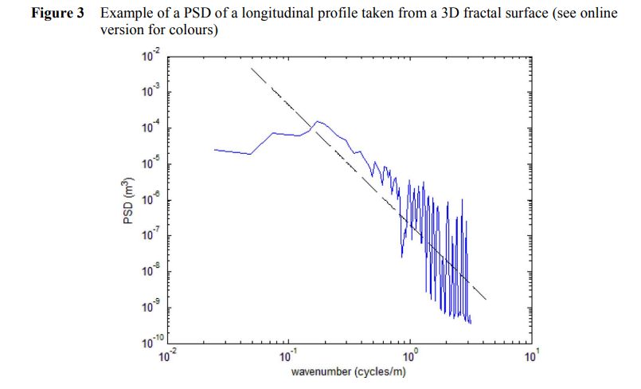
- International Roughness Index (IRI) is a method for terrain roughness estimation that uses the parameters a quarter car model at a speed of 80km/h and has a linear relationship with RMSE.
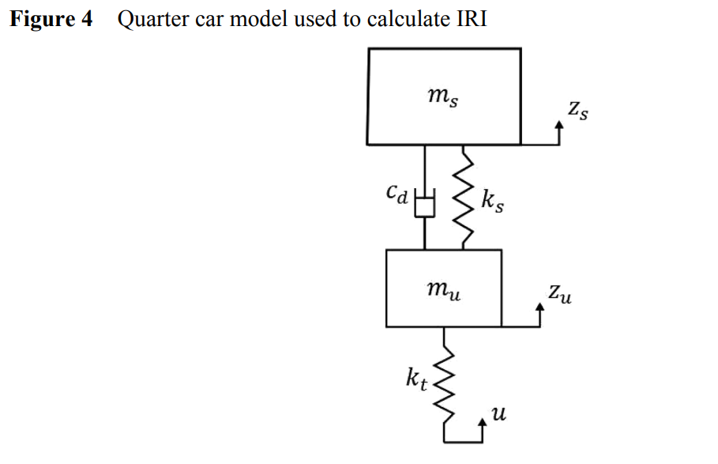
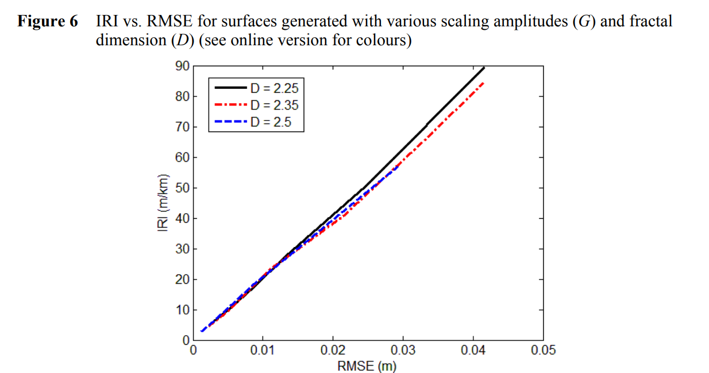
- Simulations were run for a small SUV in Carsim on 3D W-M surfaces with speeds ranging from 8 to 32 km/h.
- Conclusions:
  - The response of a vehicle travelling over the terrain surface can be evaluated using vertical acceleration, roll rate and pitch rate.
  - There may be certain speeds at which the rotation rates are higher than expected, based on the resonant behaviour of the vehicle’s suspension.
  - The 3D Weierstrass-Mandelbrot fractal function is an effective way of generating a terrain surface which can be used for vehicle simulations.
  - The surfaces generated can be evaluated using well defined terrain characterisation metrics such as the RMSE, PSD, and IRI. It was observed that both the RMSE and IRI increase exponentially for surfaces with increasing scaling coefficient (G).

